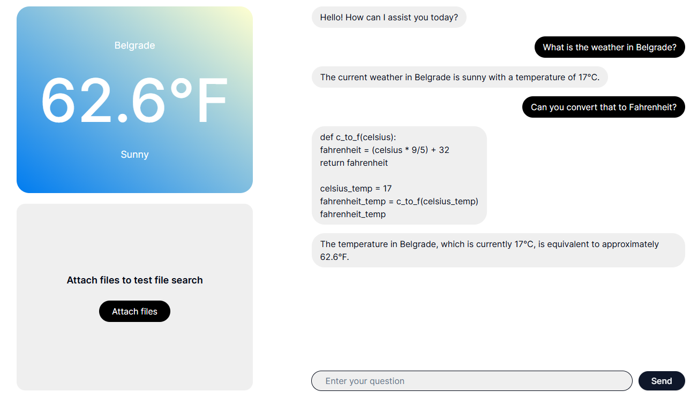

# OpenAI-Assistant

Simple demo app demonstrating use of OpenAI [Assistants API](https://platform.openai.com/docs/assistants/overview) in [Next.js](https://nextjs.org/) and [Vercel AI SDK](https://sdk.vercel.ai/docs/introduction) with [streaming](https://platform.openai.com/docs/assistants/overview/step-4-create-a-run), tool use ([code interpreter](https://platform.openai.com/docs/assistants/tools/code-interpreter) and [file search](https://platform.openai.com/docs/assistants/tools/file-search)), and [function calling](https://platform.openai.com/docs/assistants/tools/function-calling).

<br>



## Stack

- Framework: [Next.js](https://nextjs.org/) 14 (App Router)
- Chat functionality: [Vercel AI SDK](https://sdk.vercel.ai/docs/introduction)
- Assistant: [OpenAI Assistant API](https://platform.openai.com/docs/assistants/overview)
- Styling: [Tailwind CSS](https://tailwindcss.com/)

## Quickstart

### 1. Clone this repository

Run the following command to clone the repo:

```
git clone https://github.com/DraganAleksic99/openai-assistant.git
```

### 2. Install dependencies

```
cd openai-assistant
npm i
```

### 3. Fill out secrets and create an assistant

```
cp .env.local.example .env.local
```

### 4. Run app locally

```
npm run dev
```

### Open in your browser

You can now visit http://localhost:3000.
